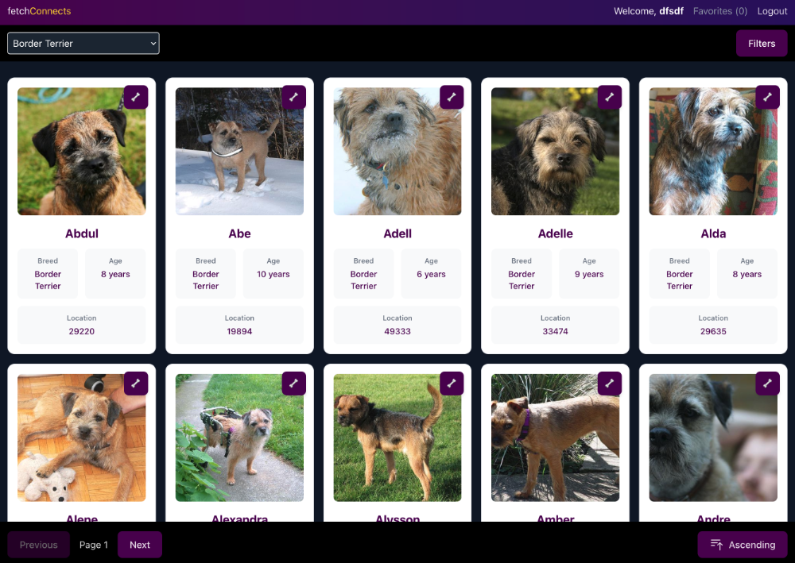
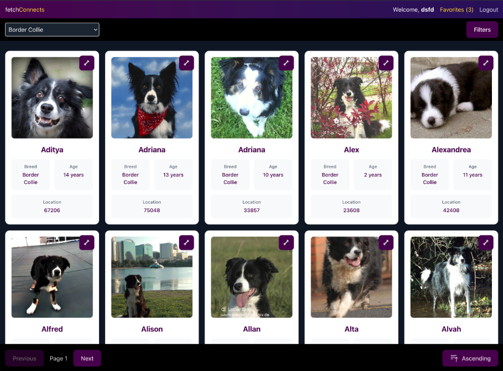
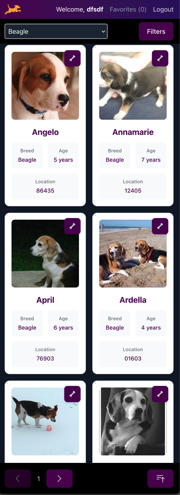

# Fetch Rewards Frontend Challenge

## 📸 Screenshots

<div align="center">

  <div style="display: flex; flex-direction: column; align-items: center; gap: 20px; margin: 10px;">
     
    
    
  </div>

  <div style="display: flex; justify-content: center; gap: 20px; margin: 10px;">
    
   
     
  </div>
</div>

## 👤 Author Details

- **Name**: Scott Jellen
- **Website**: [Scottjellen.com](https://scottjellen.com/)

- **GitHub**: [SJellen](https://github.com/SJellen)

## 🌐 Live Application

You can view the live application here: [Fetch Connects Live Demo](https://fetch-rewards-lemon.vercel.app/)

This project is a React + TypeScript application built with Vite, implementing a receipt processing system for Fetch Rewards. The application allows users to upload receipts, process them, and view their points.

## 🚀 Quick Start

### Prerequisites

- Node.js (v18 or higher)
- npm or yarn package manager

### Installation

1. Clone the repository:

```bash
git clone <repository-url>
cd fetch-rewards
```

2. Install dependencies:

```bash
npm install
# or
yarn install
```

3. Start the development server:

```bash
npm run dev
# or
yarn dev
```

The application will be available at `http://localhost:5173`

## 🛠️ Available Scripts

- `npm run dev` - Start the development server
- `npm run build` - Build the production-ready application
- `npm run preview` - Preview the production build locally
- `npm run lint` - Run ESLint to check code quality

## 🏗️ Tech Stack

- React 18
- TypeScript
- Vite
- TailwindCSS
- React Router DOM
- ESLint

## 📁 Project Structure

```
fetch-rewards/
├── src/
│   ├── components/     # Reusable UI components
│   ├── pages/         # Page components
│   ├── services/      # API and business logic services
│   ├── types/         # TypeScript type definitions
│   ├── utils/         # Utility functions
│   ├── App.tsx        # Main application component
│   └── main.tsx       # Application entry point
├── public/            # Static assets
├── index.html         # HTML template
├── package.json       # Project dependencies and scripts
├── tsconfig.json      # TypeScript configuration
├── vite.config.ts     # Vite configuration
└── tailwind.config.js # TailwindCSS configuration
```

## 📝 Code Style

This project uses ESLint for code linting and follows TypeScript best practices. The code style is enforced through the following configurations:

- ESLint for code quality
- TypeScript for type safety
- Prettier for code formatting
